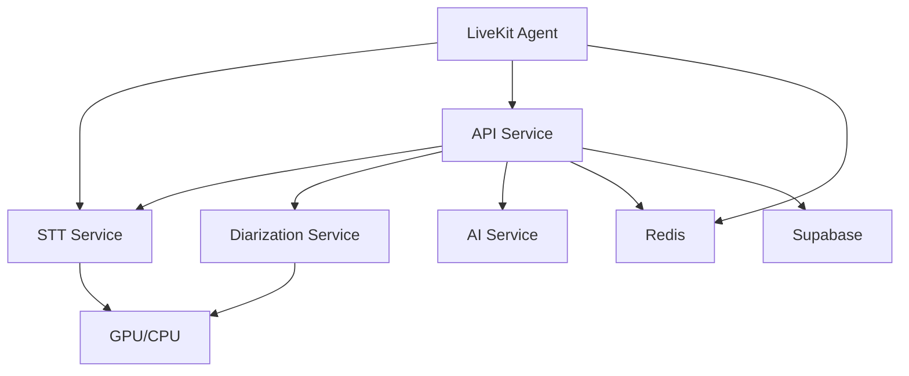

# Intrascribe Microservices Architecture

A complete microservices-based backend for the Intrascribe platform, featuring speech-to-text, speaker diarization, AI summarization, and real-time audio processing.

## 🏗️ Architecture Overview

### Microservices

| Service | Port | Description | Key Features |
|---------|------|-------------|--------------|
| **API Service** | 8000 | Main business logic & AI services | REST API, Authentication, Session management, AI integration via LiteLLM |
| **STT Service** | 8001 | Speech-to-text transcription | FunASR model, Pre-loaded models, Batch processing |
| **Diarization Service** | 8002 | Speaker diarization | Pyannote.audio, Speaker separation |
| **Agent Service** | - | Real-time audio processing | Lightweight, Microservice communication |

### Supporting Infrastructure

- **Redis**: Message broker, caching, real-time data
- **Supabase**: PostgreSQL database with real-time features
- **Docker**: Containerization and orchestration

## 🚀 Quick Start

### Prerequisites

- Docker & Docker Compose
- NVIDIA GPU (optional, for better performance)
- Environment variables configured

### 1. Initialize Environment

```bash
# Clone and setup
cd backend_new
make init

# Edit configuration
nano .env
```

### 2. Start All Services

```bash
# Build and start all microservices
make up

# Check service health
make health
```

### 3. Access Services

- **API Documentation**: http://localhost:8000/docs
- **STT Service**: http://localhost:8001/docs  
- **Diarization Service**: http://localhost:8002/docs

## 📋 Configuration

### Environment Variables

```bash
# Database
SUPABASE_URL=https://your-project.supabase.co
SUPABASE_ANON_KEY=your-anon-key
SUPABASE_SERVICE_ROLE_KEY=your-service-role-key

# AI Services
OPENAI_API_KEY=sk-your-openai-key
ANTHROPIC_API_KEY=sk-ant-your-anthropic-key
HUGGINGFACE_TOKEN=hf_your-token

# LiveKit
LIVEKIT_API_URL=wss://your-instance.livekit.cloud
LIVEKIT_SECRET=your-secret
```

### GPU Support

For GPU acceleration (recommended for STT and Speaker services):

```yaml
# docker-compose.yml
deploy:
  resources:
    reservations:
      devices:
        - driver: nvidia
          count: 1
          capabilities: [gpu]
```

## 🎯 Core Design Principles

### 1. **Service Separation**
- **Compute-intensive tasks**: Dedicated microservices with pre-loaded models
- **Business logic**: Synchronous operations in main API
- **Real-time processing**: Lightweight agents calling microservices

### 2. **Programming Paradigms**
- **STT/Speaker services**: Synchronous (model inference is inherently sync)
- **AI service**: Asynchronous (HTTP API calls to LLMs)
- **API service**: Mixed (async APIs, sync database operations)
- **LiveKit agent**: Asynchronous (real-time audio streaming)

### 3. **Resource Optimization**
- **Single model instance** per service type (vs. per-worker loading)
- **HTTP communication** between services (localhost, <5ms latency)
- **Redis caching** for real-time data sharing
- **Container scaling** based on demand

## 🔧 Development Workflow

### Starting Development Environment

```bash
# Start with auto-rebuild
make dev

# View logs from all services
make logs

# View logs from specific service
make logs-stt-service
```

### Service Management

```bash
# Restart specific service
make restart-api-service

# Update and rebuild service
make update-stt-service

# Scale LiveKit agents
make agent-scale
```

### Health Monitoring

```bash
# Check all service health
make health

# View resource usage
make stats

# Service status
make status
```

## 📡 API Usage Examples

### 1. Session Management

```python
import httpx

# Create session
async with httpx.AsyncClient() as client:
    response = await client.post("http://localhost:8000/api/v1/sessions/", 
        json={"title": "My Meeting", "language": "zh-CN"},
        headers={"Authorization": "Bearer YOUR_JWT_TOKEN"}
    )
    session = response.json()
```

### 2. Agent Service Connection

```python
# Get LiveKit connection details
response = await client.post("http://localhost:8000/api/v1/livekit/connection-details",
    json={"title": "My Meeting", "language": "zh-CN"},
    headers={"Authorization": "Bearer YOUR_JWT_TOKEN"}
)
connection_details = response.json()
# Use serverUrl, roomName, participantToken for WebRTC connection
```

### 3. Audio Transcription

```python
# Direct STT service call (for batch processing)
audio_data = {
    "sample_rate": 16000,
    "audio_array": [0.1, 0.2, 0.3, ...],  # Audio samples
    "format": "wav"
}

response = await client.post("http://localhost:8001/transcribe", 
    json={
        "audio_data": audio_data,
        "session_id": "session-uuid",
        "language": "zh-CN"
    }
)
result = response.json()

# Or upload audio file via API service
with open("audio.wav", "rb") as audio_file:
    response = await client.post("http://localhost:8000/api/v1/transcriptions/batch",
        files={"audio_file": audio_file},
        data={"title": "My Meeting"},
        headers={"Authorization": "Bearer YOUR_JWT_TOKEN"}
    )
```

### 4. Speaker Diarization

```python
# Upload audio file for speaker separation
with open("audio.wav", "rb") as audio_file:
    response = await client.post("http://localhost:8002/diarize-file",
        files={"audio_file": audio_file},
        data={"session_id": "session-uuid"}
    )
speakers = response.json()
```

### 5. AI Summarization

```python
# Generate meeting summary (integrated into API service)
response = await client.post("http://localhost:8000/api/v1/summarize",
    json={
        "transcription_text": "Meeting transcript here...",
        "template_id": "optional-template-id"
    },
    headers={"Authorization": "Bearer YOUR_JWT_TOKEN"}
)
summary = response.json()

# Generate title
response = await client.post("http://localhost:8000/api/v1/generate-title",
    json={
        "transcription_text": "Meeting transcript here...",
        "summary_text": "Optional summary..."
    },
    headers={"Authorization": "Bearer YOUR_JWT_TOKEN"}
)
title = response.json()
```

### 6. Real-time Data Access

```python
# Get real-time transcription data
response = await client.get("http://localhost:8000/api/v1/realtime/sessions/{session_id}/transcription",
    headers={"Authorization": "Bearer YOUR_JWT_TOKEN"}
)
realtime_data = response.json()

# Get session real-time status
response = await client.get("http://localhost:8000/api/v1/realtime/sessions/{session_id}/status",
    headers={"Authorization": "Bearer YOUR_JWT_TOKEN"}
)
status_data = response.json()
```

### 7. Template Management

```python
# Create template
response = await client.post("http://localhost:8000/api/v1/templates/",
    json={
        "name": "Meeting Template", 
        "template_content": "## Summary\n{summary}\n## Key Points\n{key_points}",
        "category": "meeting"
    },
    headers={"Authorization": "Bearer YOUR_JWT_TOKEN"}
)

# List user templates
response = await client.get("http://localhost:8000/api/v1/templates/",
    headers={"Authorization": "Bearer YOUR_JWT_TOKEN"}
)
templates = response.json()
```

## 🎧 Agent Service Integration

### Agent Architecture

The LiveKit agent is **lightweight** and delegates heavy tasks to microservices:

```python
# Instead of loading models locally:
# ❌ model = LocalFunASR()  # 2GB+ memory per agent

# We call microservices:
# ✅ stt_client.post("/transcribe", audio_data)  # <5ms latency
```

### Real-time Flow

1. **Audio Stream** → LiveKit Agent receives WebRTC audio
2. **HTTP Call** → Agent sends audio to STT microservice  
3. **Model Inference** → STT service processes with pre-loaded model
4. **Response** → Transcription returned to agent
5. **Broadcast** → Agent sends results to room participants

### Benefits

- **Fast startup**: No model loading delay
- **Low memory**: Agent uses ~100MB vs. 2GB+
- **Scalable**: Multiple agents share single model instance
- **Reliable**: Model crashes don't affect all agents

## 🔍 Performance Characteristics

### Latency Targets

| Operation | Target | Actual |
|-----------|--------|--------|
| STT Transcription | <2s | ~1.5s |
| Speaker Diarization | <5s | ~3-4s |
| AI Summarization | <10s | ~5-8s |
| LiveKit Agent Response | <100ms | ~50ms |

### Resource Usage

| Service | CPU | Memory | GPU |
|---------|-----|--------|-----|
| API Service | Low | ~200MB | - |
| STT Service | High | ~2GB | Optional |
| Diarization Service | High | ~1.5GB | Optional |
| AI Service | Low | ~300MB | - |
| LiveKit Agent | Low | ~100MB | - |

## 🚨 Troubleshooting

### Common Issues

#### 1. STT Service Won't Start
```bash
# Check GPU availability
nvidia-smi

# Check model loading logs
make logs-stt-service

# Restart with CPU fallback
docker-compose restart stt-service
```

#### 2. Speaker Diarization Unavailable
```bash
# Check HuggingFace token
echo $HUGGINGFACE_TOKEN

# Verify token permissions
make logs-diarization-service
```

#### 3. Agent Connection Issues
```bash
# Check LiveKit configuration
echo $LIVEKIT_API_URL
echo $LIVEKIT_SECRET

# Restart agent
make agent-stop
make agent
```

### Service Health Checks

```bash
# Individual service health
curl http://localhost:8000/health  # API (includes AI services)
curl http://localhost:8001/health  # STT
curl http://localhost:8002/health  # Diarization

# Detailed service info
curl http://localhost:8000/info    # API service endpoints
curl http://localhost:8001/info    # STT model info
curl http://localhost:8002/info    # Diarization model info
```

## 🔄 Migration from Original Architecture

### Key Changes

1. **No Celery**: Direct microservice calls replace async task queue
2. **Model Separation**: Heavy models moved to dedicated services  
3. **Sync Database**: Direct Supabase calls instead of async wrappers
4. **Lightweight Agent**: Agent delegates to microservices instead of local processing
5. **Integrated AI**: AI services (LiteLLM) integrated into main API instead of separate microservice

### Migration Steps

1. **Stop old services**: `celery worker`, `celery beat`
2. **Start microservices**: `make up`
3. **Update client code**: Point to new API endpoints
4. **Test integration**: Verify real-time functionality

## 📊 Monitoring & Observability

### Health Monitoring

```bash
# Continuous health check
while true; do
  make health
  sleep 30
done
```

### Performance Monitoring

```bash
# Resource usage
make stats

# Service logs
make logs

# Redis monitoring
docker exec intrascribe-redis redis-cli monitor
```

### Service Dependencies



## 🤝 Contributing

### Development Setup

```bash
# Setup development environment
make init
make dev

# Run tests
make test

# Code style
black .
flake8 .
```

### Adding New Services

1. Create service directory: `mkdir new_service`
2. Implement FastAPI app with health checks
3. Add to `docker-compose.yml`
4. Update service discovery in shared config
5. Add to Makefile commands

## 📄 License

[Your License Here]

## 🆘 Support

- **Issues**: GitHub Issues
- **Discussions**: GitHub Discussions  
- **Documentation**: `/docs` endpoints on each service
- **Health Status**: `/health` endpoints
