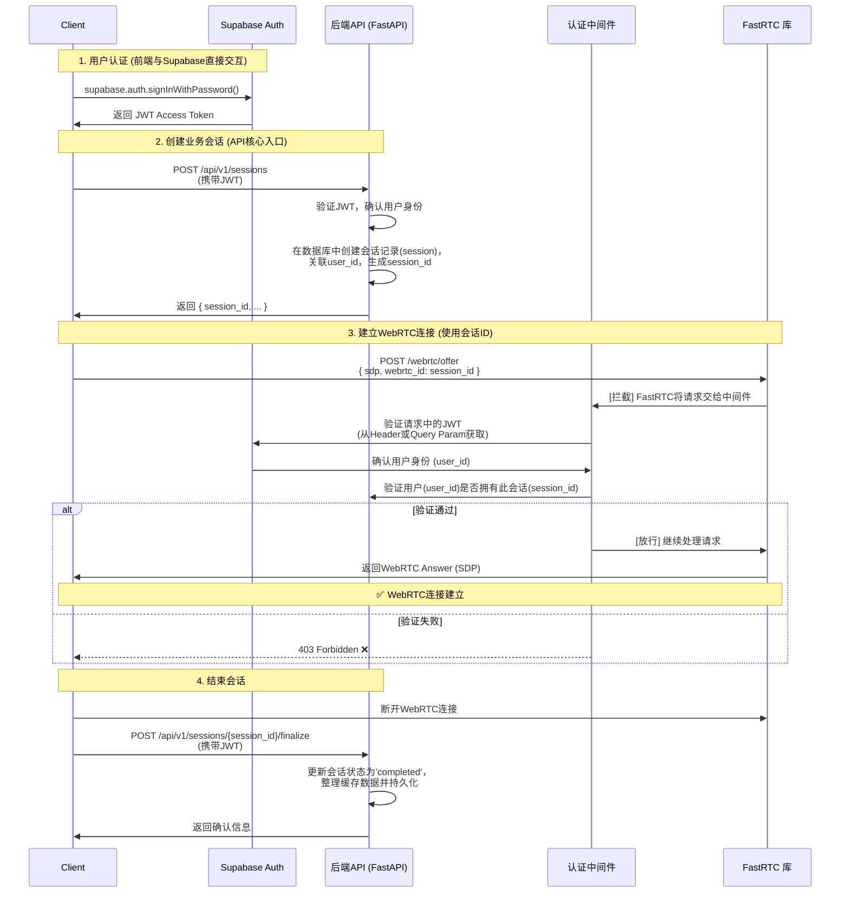

# ASR-FastRTC API 设计文档 V1

## 1. API 概览

### 1.1 API 设计原则
- **RESTful设计**：遵循REST架构风格。
- **流程驱动**：API围绕核心用户流程（开始、进行、结束会话）设计。
- **分层认证**：根据安全需求分层设计认证策略。
- **一致性**：统一的请求响应格式和错误处理。
- **版本控制**：通过URL支持API版本管理 (`/api/v1/...`)。

### 1.2 基础信息
- **Base URL**: `https://api.yourdomain.com` (默认为localhost)
- **API Version**: `v1`
- **Content-Type**: `application/json`
- **认证方式**: `Bearer Token` (由Supabase签发的JWT)

### 1.3 HTTP状态码规范
- `200` OK - 请求成功。
- `201` Created - 资源创建成功（例如，新会话）。
- `400` Bad Request - 请求参数错误或格式无效。
- `401` Unauthorized - 未提供或无效的认证Token。
- `403` Forbidden - 已认证，但无权访问该资源。
- `404` Not Found - 请求的资源不存在。
- `429` Too Many Requests - 请求频率超限。
- `500` Internal Server Error - 服务器内部错误。

## 2. 认证与架构

### 2.1 认证分层策略

| 层级 | 说明 | 认证要求 | 使用场景 |
|------|------|----------|----------|
| **Public** | 公开访问 | 无需认证 | 系统健康检查、API文档。 |
| **Authenticated** | 用户级认证 | Bearer Token | 获取用户资料、查询历史会话/转录记录。 |
| **Session-bound** | 会话级认证 | Token + 会话所有权 | **核心场景**: 创建/结束实时会话、建立WebRTC连接、获取实时转录。|
| **Admin** | 管理员权限 | Token + 管理员角色 | 系统管理功能。 |

### 2.2 核心架构：会话与RTC连接统一

我们采用**会话驱动**的架构，将业务会话(`session`)和WebRTC连接(`webrtc`)视为一个整体。

**核心原则**: `webrtc_id` 就是 `session_id`。

这极大地简化了系统：
- **统一标识**: 从创建到结束，整个生命周期都使用 `session_id`。
- **天然权限**: 验证用户对 `session_id` 的所有权，就等于验证了他对WebRTC连接的权限。
- **简化流程**: 客户端无需管理和映射两套ID。

### 2.3 认证与会话建立流程



### 2.4参考的中间件实现
fastrtc直接将端口mount到fastapi之上，对外公开暴露，需要再不修改源码的情况下，对fastrtc的端口添加中间件进行认证保护：

```python
from supabase import create_client, Client
from fastapi import Request, HTTPException
import os

class SimplifiedRTCAuthMiddleware:
    def __init__(self):
        # 初始化 Supabase 客户端（系统级访问）
        self.supabase: Client = create_client(
            os.getenv("SUPABASE_URL"),
            os.getenv("SUPABASE_SERVICE_ROLE_KEY")  # 使用服务角色密钥
        )
    
    async def __call__(self, request: Request, call_next):
        if request.url.path.startswith(("/webrtc/", "/transcript")):
            await self._validate_session_access(request)
        
        response = await call_next(request)
        return response
    
    async def _validate_session_access(self, request: Request):
        # 1. 提取 session_id (就是 webrtc_id)
        session_id = self._extract_session_id(request)
        if not session_id:
            raise HTTPException(401, "缺少 session_id")
        
        # 2. 验证用户token
        user_token = self._extract_token(request)
        if not user_token:
            raise HTTPException(401, "需要认证")
        
        # 3. 通过 Supabase 验证用户
        try:
            # 使用用户token获取用户信息
            user_response = self.supabase.auth.get_user(user_token)
            if not user_response.user:
                raise HTTPException(401, "认证失败")
            
            user_id = user_response.user.id
        except Exception:
            raise HTTPException(401, "Token 验证失败")
        
        # 4. 验证会话权限（关键检查）
        try:
            session_response = self.supabase.table('sessions').select('*').eq(
                'id', session_id
            ).eq(
                'user_id', user_id
            ).execute()
            
            if not session_response.data:
                raise HTTPException(403, "无权访问此会话")
            
            session = session_response.data[0]
            
        except Exception as e:
            raise HTTPException(403, f"会话验证失败: {str(e)}")
        
        # 5. 注入信息供下游使用
        request.state.session_id = session_id
        request.state.user_id = user_id
        request.state.session = session
    
    def _extract_session_id(self, request: Request) -> str:
        # 从不同位置提取 session_id/webrtc_id
        if request.url.path.startswith("/transcript"):
            return request.query_params.get("webrtc_id")
        elif request.url.path.startswith("/webrtc/"):
            return getattr(request.state, 'json_body', {}).get('webrtc_id')
        return None
    
    def _extract_token(self, request: Request) -> str:
        return (
            request.headers.get("Authorization", "").replace("Bearer ", "") or
            request.query_params.get("token") or
            request.query_params.get("access_token")
        )
```


## 3. 核心用户流程与API映射

1.  **用户登录**: 完全由前端和 Supabase Auth 处理，后端API不参与。
2.  **获取历史记录**: 前端直接通过 Supabase 客户端查询 `recording_sessions` 表及其关联数据（转录、AI总结）。
3.  **用户点击录制 (创建会话)**:
    - **Step 1**: 调用 `POST /api/v1/sessions` 创建一个新会话，获取 `session_id`。
    - **Step 2**: 使用返回的 `session_id` 作为 `webrtc_id`，调用 FastRTC 的 `/webrtc/offer` 端点建立音频连接。
    - **Step 3**: 使用 `session_id` 和JWT，通过Server-Sent Events (`/transcript?webrtc_id=...&token=...`) 监听实时转录结果。
4.  **用户点击停止 (结束会话)**:
    - **Step 1**: 客户端断开WebRTC连接。
    - **Step 2**: 调用 `POST /api/v1/sessions/{session_id}/finalize` 通知后端会话已结束，触发数据整理和持久化。

---

## 4. 公开API (Public)

### 4.1 健康检查
```http
GET /api/v1/health
```
**响应示例:**
```json
{
  "status": "healthy",
  "timestamp": "2024-01-01T12:00:00Z",
  "version": "1.0.0"
}
```

## 5. 认证API (Authenticated - 用户级)
*需要 `Bearer Token`*

### 5.1 用户业务信息

#### 获取用户业务资料
```http
GET /api/v1/user/profile
Authorization: Bearer {token}
```
**说明**: 获取用户的订阅、配额、偏好等业务相关数据。基础信息(email, name)应通过Supabase SDK获取。
**响应示例:**
```json
{
  "subscription": { "plan": "pro", "status": "active", "expires_at": "2024-12-31T23:59:59Z" },
  "quotas": {
    "transcription_minutes": { "used": 150, "limit": 1000 },
    "ai_summary_count": { "used": 25, "limit": 100 }
  },
  "preferences": { "default_language": "zh-CN", "auto_summary": true }
}
```

#### 更新用户业务偏好
```http
PUT /api/v1/user/preferences
Authorization: Bearer {token}
```
**请求体:**
```json
{
  "default_language": "en-US",
  "auto_summary": false
}
```

### 5.2 历史数据查询

前端使用 `useRecordingSessions` Hook 直接查询数据库：

```typescript
// 实际使用的查询方式
const { data, error } = await supabase
  .from('recording_sessions')
  .select(`
    *,
    audio_files (
      id,
      original_filename,
      duration_seconds,
      upload_status,
      file_size_bytes,
      format
    ),
    transcriptions (
      id,
      content,
      confidence_score,
      word_count,
      status,
      created_at
    ),
    ai_summaries (
      id,
      summary,
      key_points,
      quality_rating,
      status,
      created_at
    )
  `)
  .eq('user_id', user.id)
  .order('created_at', { ascending: false })
```

### 5.3 AI 服务 (独立调用)
*需要 `Bearer Token`*

#### 生成 AI 总结
```http
POST /api/summarize
Authorization: Bearer {token}
```
**说明**: 根据提供的转录文本生成AI总结。这是一个独立的、无状态的接口。

**请求体:**
```json
{
  "transcription": "这里是完整的会议转录内容..."
}
```

**成功响应示例:**
```json
{
  "summary": "这是由AI生成的会议总结...",
  "metadata": {
    "model_used": "gemma2",
    "success": true,
    "total_processing_time": 2.5,
    "transcription_length": 5000,
    "timestamp": 1672531200
  }
}
```

**失败响应示例:**
```json
{
  "summary": "AI总结生成失败：[错误信息]",
  "metadata": {
    "error": "[错误信息]",
    "fallback_used": true,
    "timestamp": 1672531200,
    "transcription_length": 5000
  }
}
```

#### 生成 AI 标题
```http
POST /api/generate-title
Authorization: Bearer {token}
```
**说明**: 根据提供的转录文本（和可选的总结）生成一个简洁的标题。

**请求体:**
```json
{
  "transcription": "这里是完整的会议转录内容...",
  "summary": "这里是可选的AI总结内容，如果提供可以帮助生成更精准的标题"
}
```

**成功响应示例:**
```json
{
  "title": "AI 生成的会议标题",
  "metadata": {
    "model_used": "gemma2",
    "success": true,
    "total_processing_time": 0.8,
    "transcription_length": 5000,
    "summary_provided": true,
    "timestamp": 1672531200
  }
}
```

**失败响应示例 (返回默认标题):**
```json
{
  "title": "会议记录 2024-07-29 10:30",
  "metadata": {
    "error": "[错误信息]",
    "fallback_used": true,
    "timestamp": 1672531200,
    "transcription_length": 5000
  }
}
```


## 6. 会话生命周期API (Session-bound)
*需要 `Bearer Token` + 对该会话的所有权*

### 6.1 开始一个新会话

#### 创建并初始化会话
```http
POST /api/v1/sessions
Authorization: Bearer {token}
```
**说明**: 这是开始一次新录音的 **唯一入口点**。它会创建一个业务会话，并返回用于建立WebRTC连接的`session_id`。

**请求体:**
```json
{
  "title": "我的新会议",
  "language": "zh-CN",
  "stt_model": "whisper"
}
```

**响应示例 (201 Created):**
```json
{
  "session_id": "e4a5b6f7-1c2d-3e4f-a5b6-c7d8e9f0a1b2",
  "title": "我的新会议",
  "status": "created",
  "created_at": "2024-01-01T14:00:00Z",
  "language": "zh-CN",
  "usage_hint": "Use this 'session_id' as 'webrtc_id' for your WebRTC connection."
}
```

### 6.2 进行中的会话

#### 建立WebRTC连接 (由FastRTC原生提供)
在获取到 `session_id` 后，客户端立即调用此端点。
```http
POST /webrtc/offer
```
**请求体:**
```json
{
  "sdp": "SDP offer description...",
  "type": "offer",
  "webrtc_id": "e4a5b6f7-1c2d-3e4f-a5b6-c7d8e9f0a1b2" // 关键：使用上一步获取的 session_id
}
```
**认证**: 后端中间件会拦截此请求，验证请求者是否拥有该`session_id`。

建立连接后，数据会流转到`async def transcribe(audio: tuple[int, np.ndarray], transcript: str):` 函数进行转录，转录完成后，会通过yeild方式到fastrtc内部的队列，然后到SSE端点通知客户端。同时，数据进行缓存。

缓存当前先缓存到一个python对象中，后续会替换成redis。

数据的格式为：
```json
"index" : 1,2 ... n
"speaker" : "speaker1"
"timestamp" : [00:00:00:000,00:00:10:000] //精确到ms
"text" : "转录后的文本"
```

#### 监听实时转录 (由FastRTC原生提供)
```http
GET /transcript?webrtc_id={session_id}&token={jwt_token}
```
**说明**:
- `webrtc_id`: 同样使用 `session_id`。
- `token`: **必须** 在查询参数中传递用户的JWT，因为Server-Sent Events (SSE) 不支持`Authorization`头。
**响应格式 (Server-Sent Events):**
```
event: output
data: {"index": 1, "speaker": "zhangsan", "timestamp": "00:00:10:100-00:00:10:500", "text": "这是", "is_final": false}

event: output
data: {"index": 1, "speaker": "zhangsan", "timestamp": "00:00:10:100-00:00:11:200", "text": "这是实时转录的", "is_final": false}

event: output
data: {"index": 1, "speaker": "zhangsan", "timestamp": "00:00:10:100-00:00:11:800", "text": "这是实时转录的结果。", "is_final": true}
```

### 6.3 结束一个会话

#### 结束并整理会话
```http
POST /api/v1/sessions/{session_id}/finalize
Authorization: Bearer {token}
```
**说明**: 当用户点击"停止"时调用。此端点会通知后端：
1.  该会话已正常结束。
2.  触发服务器进行数据整理和持久化，**包括将内存中的音频片段拼接、转换为目标格式（如MP3），并上传到对象存储**。此步骤涵盖了原 `POST /api/audio/process` 的功能。
3.  更新会话状态为 `completed`。

注意：音频数据需要进行拼接和格式转换后，最终再进行存储。

**响应示例:**
```json
{
  "message": "Session finalized successfully.",
  "session_id": "e4a5b6f7-1c2d-3e4f-a5b6-c7d8e9f0a1b2",
  "status": "completed",
  "final_data": {
    "total_duration_seconds": 185.5,
    "word_count": 350,
    "audio_file_path": "audio/e4a5b6f7-....mp3",
    "transcription_saved": true
  }
}
```
### 6.4 后端实现策略：会话缓存
为实现高性能的实时转录，后端将为每个活跃会话维护一个内存缓存对象 (`SessionCache`)。
- **实时缓存**: 所有转录片段和音频块首先写入内存。
- **定期持久化**: 后台任务会定时（如每30秒）将缓存中的转录文本更新到数据库，防止数据丢失。
- **最终持久化**: 调用 `/finalize` 接口时，将完整的转录文本和合并后的音频文件一次性写入数据库和对象存储。
- **自动清理**: 对于长时间不活跃（如超过30分钟）的会话，系统会自动将其`finalize`并清理缓存，防止内存泄漏。


### 6.5 获取会话详情
```http
GET /api/v1/sessions/{session_id}
```
**说明**: 获取单个会话的详细信息，建议响应中包含子资源（转录、总结、音频文件）的概要列表。
**响应示例:**
```json
{
  "id": "session-uuid-1234",
  "title": "产品会议纪要",
  "status": "completed",
  "created_at": "2024-01-01T14:00:00Z",
  "transcriptions": [ { "id": "trans-uuid-5678", "content_preview": "..." } ],
  "summaries": [ { "id": "summary-uuid-9012", "summary_preview": "..." } ],
  "audio_files": [ { "id": "audio-uuid-5678", "public_url": "..." } ]
}
```
### 6.6 获取会话的音频文件列表
```http
GET /api/v1/sessions/{session_id}/audio_files
```
**说明**: 获取指定会话关联的所有音频文件的详细列表。

### 6.7 获取单个音频文件详情
```http
GET /api/v1/sessions/{session_id}/audio_files/{file_id}
```
**说明**: 获取指定会话下的单个音频文件的详细信息。这能确保音频文件与会话的从属关系。


## 7. 错误处理

### 7.1 标准错误响应格式
```json
{
  "error": {
    "code": "SESSION_ACCESS_DENIED",
    "message": "You do not have permission to access this session.",
    "request_id": "req-uuid-1234",
    "path": "/api/v1/sessions/some-other-users-session-id/finalize"
  }
}
```

### 7.2 常见错误代码
| 错误代码 | HTTP状态码 | 说明 |
|---|---|---|
| `AUTHENTICATION_REQUIRED` | 401 | 需要认证 |
| `AUTHORIZATION_DENIED` | 403 | 权限不足 (非会话相关) |
| `RESOURCE_NOT_FOUND` | 404 | 资源不存在 |
| `VALIDATION_ERROR` | 400 | 请求参数验证失败 |
| `QUOTA_EXCEEDED` | 429 | 账户配额用尽 |
| `SESSION_NOT_FOUND` | 404 | 提供的`session_id`无效或不存在 |
| `SESSION_ACCESS_DENIED`| 403 | 无权访问此`session_id` |

## 8. 客户端集成示例

```javascript
// ASR-FastRTC Client (Simplified Example)

// 0. 假设用户已通过 Supabase 登录
// const { data, error } = await supabase.auth.signInWithPassword(...)
// const userToken = data.session.access_token;

const API_BASE = '/api/v1';

class RecordingSession {
  constructor(token) {
    this.token = token;
    this.sessionId = null;
    this.peerConnection = null;
    this.eventSource = null;
  }

  // 对应流程步骤 3: 用户点击录制
  async start() {
    console.log('Starting a new session...');
    // Step 3.1: 创建业务会话
    const response = await fetch(`${API_BASE}/sessions`, {
      method: 'POST',
      headers: {
        'Authorization': `Bearer ${this.token}`,
        'Content-Type': 'application/json'
      },
      body: JSON.stringify({ title: 'New Recording', language: 'zh-CN' })
    });

    if (!response.ok) {
      throw new Error('Failed to create session');
    }

    const sessionData = await response.json();
    this.sessionId = sessionData.session_id;
    console.log(`Session created: ${this.sessionId}`);

    // Step 3.2: 建立 WebRTC 连接
    // (WebRTC setup code: createPeerConnection, get user media, etc.)
    // ...
    // const offer = await this.peerConnection.createOffer();
    // await this.peerConnection.setLocalDescription(offer);

    const webrtcResponse = await fetch('/webrtc/offer', {
        method: 'POST',
        headers: { 'Content-Type': 'application/json' },
        body: JSON.stringify({
            sdp: offer.sdp,
            type: offer.type,
            webrtc_id: this.sessionId // 使用 session_id!
        })
    });
    // (Handle webrtcResponse.json() to set remote description)
    // ...
    
    // Step 3.3: 监听实时转录
    const transcriptUrl = `/transcript?webrtc_id=${this.sessionId}&token=${this.token}`;
    this.eventSource = new EventSource(transcriptUrl);
    this.eventSource.addEventListener("output", (event) => {
      const transcript = JSON.parse(event.data);
      console.log('Live Transcript:', transcript.text);
      // Update UI...
    });
    
    console.log('Recording and transcription started.');
  }

  // 对应流程步骤 4: 用户点击停止
  async stop() {
    if (!this.sessionId) return;
    
    console.log('Stopping session...');
    // Step 4.1: 关闭连接
    if (this.eventSource) this.eventSource.close();
    if (this.peerConnection) this.peerConnection.close();

    // Step 4.2: 通知后端结束会话
    const response = await fetch(`${API_BASE}/sessions/${this.sessionId}/finalize`, {
      method: 'POST',
      headers: { 'Authorization': `Bearer ${this.token}` }
    });
    
    const finalData = await response.json();
    console.log('Session finalized on server:', finalData);
    this.sessionId = null;
  }
}

// 使用示例:
// const mySession = new RecordingSession(userToken);
// recordButton.onclick = () => mySession.start();
// stopButton.onclick = () => mySession.stop();
```