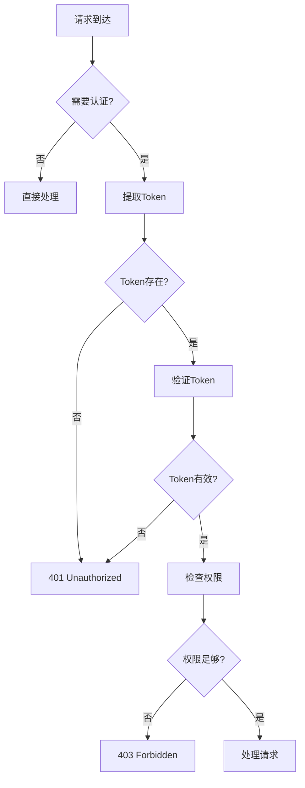
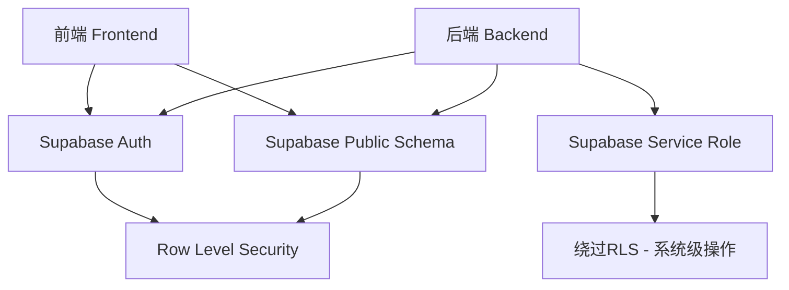
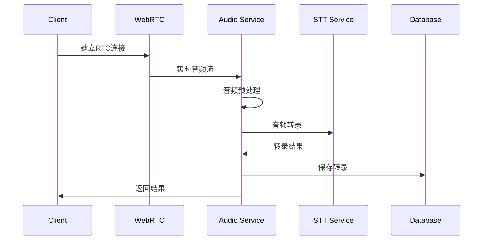
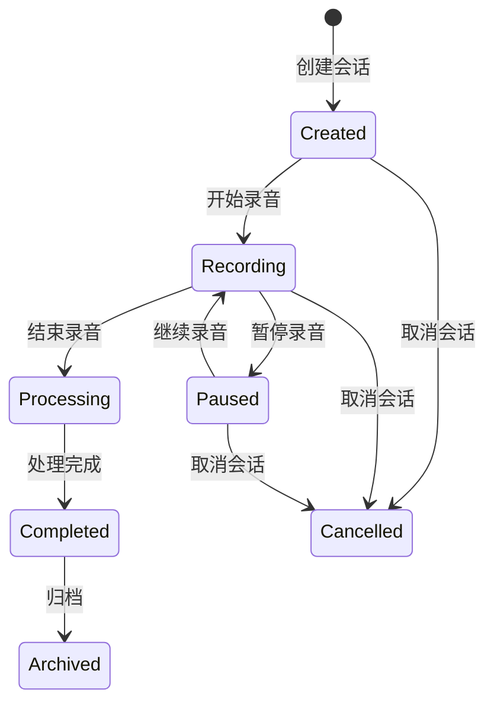

# ASR-FastRTC 架构设计文档

## 1. 总体架构概览

### 1.1 架构原则
- **分离关注点**：认证、业务逻辑、数据访问分层处理
- **依赖倒置**：高层模块不依赖低层模块，都依赖抽象
- **单一职责**：每个模块只负责一个明确的功能
- **开放封闭**：对扩展开放，对修改封闭

### 1.2 技术栈
- **后端框架**：FastAPI + Python 3.12
- **认证服务**：Supabase Auth
- **数据库**：PostgreSQL (via Supabase)
- **实时通信**：FastRTC（内部封装WebRTC/WebSocket/phone。默认使用rtc）
- **前端框架**：Next.js 14 + TypeScript
- **状态管理**：Zustand
- **UI组件**：Tailwind CSS + shadcn/ui

## 2. 后端分层架构

### 2.1 目录结构 (演进式)
我们采用一个更精简的初始结构，将所有核心逻辑模块都放在 `app` 目录下，并以单文件形式存在。当项目复杂度增加时，任何一个文件都可以平滑地演进为一个模块（目录）。

```
backend/
├── main.py                          # 应用入口，负责初始化和启动FastAPI应用
└── app/
    ├── __init__.py
    ├── api.py                       # API路由层: 定义所有API端点
    ├── services.py                  # 业务逻辑层: 包含核心业务逻辑
    ├── repositories.py              # 数据仓储层: 负责数据库交互
    ├── models.py                    # 领域模型: 定义核心业务对象
    ├── schemas.py                   # 数据传输对象 (DTOs): Pydantic模型，用于API验证
    ├── dependencies.py              # 依赖注入: FastAPI的依赖项
    ├── config.py                    # 应用配置
    └── clients.py                   # 外部服务客户端
```

### 2.2 分层职责说明 (演进式架构)

这种演进式架构，在项目初期能保持最大的简洁性，同时为未来的扩展提供了清晰的路径。

-   **`main.py`**: **应用入口**。只负责创建FastAPI实例、挂载`app/api.py`中的路由，并启动应用。保持该文件尽可能简洁。

-   **`app/api.py`**: **API路由**。使用 `APIRouter` 定义所有的API端点。当端点数量增多时，可以将其拆分为一个`app/api/`目录，并按资源（如`sessions.py`, `users.py`）组织路由文件。

-   **`app/services.py`**: **业务服务**。实现核心业务逻辑。初期所有服务可以放在这个文件中。随着业务变复杂，可拆分为`app/services/`目录，每个文件代表一个服务（如`session_service.py`）。

-   **`app/repositories.py`**: **数据仓储**。封装所有数据库的增删改查操作，为服务层提供清晰的数据访问接口。同样，未来可以演进为`app/repositories/`目录。

-   **`app/models.py`**: **领域模型**。定义应用的核心业务实体（如`User`, `Session`）。如果使用ORM，这里也会包含ORM模型。

-   **`app/schemas.py`**: **数据传输对象 (DTOs)**。包含所有用于API请求和响应验证的Pydantic模型。

-   **`app/dependencies.py`**: **依赖注入**。定义FastAPI的可重用依赖项，例如获取认证用户、数据库连接等。

-   **`app/config.py`**: **配置管理**。通过Pydantic的`BaseSettings`来管理应用配置，支持从环境变量加载。

-   **`app/clients.py`**: **外部服务客户端**。封装对第三方API（如Supabase, STT服务）的调用逻辑。当客户端变多时，可以重构为 `app/clients/` 目录。

这种方法避免了在项目刚启动时就引入不必要的复杂性，让开发者能更专注于核心功能的实现。

## 3. 认证架构设计

### 3.1 认证层级定义

```python
class AuthLevel:
    PUBLIC = "public"           # 公开访问，无需认证
    AUTHENTICATED = "auth"      # 需要用户认证
    SESSION_BOUND = "session"   # 需要认证 + 会话权限
    RTC_AUTHORIZED = "rtc"      # 需要认证 + RTC权限
    ADMIN = "admin"            # 需要管理员权限
```

### 3.2 认证依赖链

```
可选认证 (Optional Auth)
    ↓
必需认证 (Required Auth)
    ↓
角色权限 (Role-based Auth)
    ↓
资源权限 (Resource-based Auth)
```

### 3.3 认证流程图



## 3.4 Supabase 访问原则

### 3.4.1 访问策略概览

Supabase支持前后端直接访问，但需要遵循明确的访问原则以确保安全性和数据一致性：



### 3.4.2 前端直接访问 Supabase

#### 允许的操作：
- **用户认证**：登录、注册、密码重置
- **用户资料管理**：查看和更新用户基本信息
- **实时订阅**：订阅数据变化（通过RLS保护）
- **基础查询**：查询用户有权限访问的数据

#### 访问配置：
```typescript
// web/lib/supabase.ts
import { createClient } from '@supabase/supabase-js'

const supabaseUrl = process.env.NEXT_PUBLIC_SUPABASE_URL!
const supabaseAnonKey = process.env.NEXT_PUBLIC_SUPABASE_ANON_KEY!

// 前端使用 anon key
export const supabase = createClient(supabaseUrl, supabaseAnonKey, {
  auth: {
    autoRefreshToken: true,
    persistSession: true,
    detectSessionInUrl: true
  },
  realtime: {
    params: {
      eventsPerSecond: 10
    }
  }
})
```

#### 前端访问示例：
```typescript
// 用户认证
const { data, error } = await supabase.auth.signInWithPassword({
  email: 'user@example.com',
  password: 'password'
})

// 查询用户会话（受RLS保护）
const { data: sessions } = await supabase
  .from('recording_sessions')
  .select('*')
  .eq('user_id', user.id)

// 实时订阅
const subscription = supabase
  .channel('sessions')
  .on('postgres_changes', {
    event: 'INSERT',
    schema: 'public',
    table: 'recording_sessions',
    filter: `user_id=eq.${user.id}`
  }, handleNewSession)
  .subscribe()
```

### 3.4.3 后端访问 Supabase

#### 使用场景：
- **系统级操作**：需要绕过RLS的管理操作
- **复杂业务逻辑**：涉及多表事务的操作
- **数据聚合**：跨用户的统计和分析
- **批量操作**：大量数据的导入导出
- **敏感操作**：涉及计费、配额的操作

#### 访问配置：
```python
# backend/infrastructure/database/supabase_client.py
from supabase import create_client, Client
from typing import Dict, Any
import os

class SupabaseClient:
    """Supabase客户端管理"""
    
    def __init__(self):
        self.url = os.getenv('SUPABASE_URL')
        self.anon_key = os.getenv('SUPABASE_ANON_KEY')
        self.service_role_key = os.getenv('SUPABASE_SERVICE_ROLE_KEY')
        
        # 用户级别的客户端（受RLS保护）
        self._anon_client: Client = create_client(self.url, self.anon_key)
        
        # 系统级别的客户端（绕过RLS）
        self._service_client: Client = create_client(self.url, self.service_role_key)
    
    def get_user_client(self, access_token: str = None) -> Client:
        """获取用户级别的客户端"""
        if access_token:
            # 设置用户认证令牌
            self._anon_client.auth.session = {"access_token": access_token}
        return self._anon_client
    
    def get_service_client(self) -> Client:
        """获取系统级别的客户端（谨慎使用）"""
        return self._service_client

# 全局实例
supabase_client = SupabaseClient()
```

### 3.4.4 访问权限矩阵

| 数据类型 | 前端访问 | 后端用户级 | 后端系统级 | RLS策略 |
|----------|----------|------------|------------|---------|
| 用户认证 | ✅ 直接 | ✅ 验证 | ✅ 管理 | N/A |
| 用户资料 | ✅ 自己的 | ✅ 验证后 | ✅ 所有 | user_id = auth.uid() |
| 会话数据 | ✅ 自己的 | ✅ 验证后 | ✅ 所有 | user_id = auth.uid() |
| 转录内容 | ✅ 自己的 | ✅ 验证后 | ✅ 所有 | session.user_id = auth.uid() |
| AI总结 | ✅ 自己的 | ✅ 验证后 | ✅ 所有 | session.user_id = auth.uid() |
| 系统配置 | ❌ 禁止 | ❌ 禁止 | ✅ 所有 | false (仅系统级) |
| 用户统计 | ❌ 禁止 | ❌ 禁止 | ✅ 所有 | false (仅系统级) |
| 审计日志 | ❌ 禁止 | ❌ 禁止 | ✅ 所有 | false (仅系统级) |

### 3.4.5 Row Level Security (RLS) 策略

#### 用户资料表 RLS：
```sql
-- 用户只能查看和更新自己的资料
CREATE POLICY "users_policy" ON user_profiles
  FOR ALL 
  TO authenticated 
  USING (user_id = auth.uid())
  WITH CHECK (user_id = auth.uid());
```

#### 会话表 RLS：
```sql
-- 用户只能访问自己的会话
CREATE POLICY "sessions_policy" ON recording_sessions
  FOR ALL 
  TO authenticated 
  USING (user_id = auth.uid())
  WITH CHECK (user_id = auth.uid());
```

#### 转录表 RLS：
```sql
-- 通过会话关联检查用户权限
CREATE POLICY "transcriptions_policy" ON transcriptions
  FOR ALL 
  TO authenticated 
  USING (
    EXISTS (
      SELECT 1 FROM recording_sessions 
      WHERE recording_sessions.id = transcriptions.session_id 
      AND recording_sessions.user_id = auth.uid()
    )
  );
```

### 3.4.6 数据访问模式

#### 模式一：前端直接访问（推荐用于简单查询）
```typescript
// 优点：延迟低，减轻服务器负载
// 缺点：无法进行复杂业务逻辑处理

const { data: sessions } = await supabase
  .from('recording_sessions')
  .select(`
    *,
    transcriptions (id, content, created_at),
    ai_summaries (id, summary, created_at)
  `)
  .eq('user_id', user.id)
  .order('created_at', { ascending: false })
```

#### 模式二：后端API访问（推荐用于复杂操作）
```python
# 优点：集中业务逻辑，更好的错误处理
# 缺点：增加网络延迟

async def create_session_with_validation(
    user_id: str, 
    title: str, 
    language: str
) -> Session:
    """创建会话并进行业务验证"""
    
    # 检查用户配额
    quota_service = QuotaService()
    if not await quota_service.check_session_quota(user_id):
        raise BusinessLogicError("Session quota exceeded")
    
    # 创建会话
    client = supabase_client.get_service_client()
    result = await client.table('recording_sessions').insert({
        'user_id': user_id,
        'title': title,
        'language': language,
        'status': 'created'
    }).execute()
    
    return Session.from_dict(result.data[0])
```

### 3.4.7 实时数据同步

#### 前端实时订阅：
```typescript
// 订阅用户相关的数据变化
const setupRealtimeSubscription = (userId: string) => {
  const subscription = supabase
    .channel('user_data')
    .on('postgres_changes', {
      event: '*',
      schema: 'public',
      table: 'recording_sessions',
      filter: `user_id=eq.${userId}`
    }, handleSessionChange)
    .on('postgres_changes', {
      event: '*', 
      schema: 'public',
      table: 'transcriptions',
      filter: `session_id=in.(${userSessionIds.join(',')})`
    }, handleTranscriptionChange)
    .subscribe()
    
  return subscription
}
```

### 3.4.8 安全最佳实践

#### 1. 密钥管理
```bash
# 环境变量配置
SUPABASE_URL=https://your-project.supabase.co
SUPABASE_ANON_KEY=eyJ...  # 前端可见，用于RLS保护的操作
SUPABASE_SERVICE_ROLE_KEY=eyJ...  # 后端专用，具有绕过RLS的权限
```

#### 2. API密钥轮换
```python
# 定期轮换Service Role密钥
async def rotate_service_key():
    """轮换服务密钥的策略"""
    # 1. 生成新密钥
    # 2. 更新环境变量
    # 3. 重启服务
    # 4. 撤销旧密钥
    pass
```

#### 3. 访问日志监控
```python
# 监控敏感操作
class SupabaseAuditMiddleware:
    async def log_sensitive_operation(
        self, 
        operation: str, 
        table: str, 
        user_id: str = None
    ):
        """记录敏感操作日志"""
        await self.audit_logger.log({
            'operation': operation,
            'table': table,
            'user_id': user_id,
            'timestamp': datetime.utcnow(),
            'client_type': 'service' if not user_id else 'user'
        })
```

### 3.4.9 错误处理策略

```python
class SupabaseErrorHandler:
    """Supabase错误处理"""
    
    @staticmethod
    def handle_supabase_error(error) -> Exception:
        """将Supabase错误转换为业务异常"""
        
        if 'row-level security' in str(error).lower():
            return AuthorizationError("Access denied to this resource")
        elif 'duplicate key' in str(error).lower():
            return ValidationError("Resource already exists")
        elif 'foreign key' in str(error).lower():
            return ValidationError("Referenced resource not found")
        else:
            return ExternalServiceError(f"Database error: {error}")
```

这种分层的Supabase访问策略确保了：
- **安全性**：通过RLS和不同权限级别的密钥保护数据
- **性能**：前端直接访问减少延迟，后端处理复杂逻辑
- **可维护性**：清晰的访问边界和权限控制
- **扩展性**：支持未来的功能扩展和权限细化

## 4. 数据流架构

### 4.1 音频处理流程



### 4.2 会话管理流程



## 5. 错误处理架构

### 5.1 异常层次结构

```python
class BaseAppException(Exception):
    """应用基础异常"""
    pass

class AuthenticationError(BaseAppException):
    """认证相关异常"""
    pass

class AuthorizationError(BaseAppException):
    """授权相关异常"""
    pass

class BusinessLogicError(BaseAppException):
    """业务逻辑异常"""
    pass

class ExternalServiceError(BaseAppException):
    """外部服务异常"""
    pass
```

### 5.2 错误处理策略

- **API层**：捕获所有异常，转换为标准HTTP响应
- **业务层**：抛出领域特定异常，不处理HTTP相关逻辑
- **基础设施层**：处理技术异常，转换为业务异常

## 6. 性能优化策略

### 6.1 数据库优化
- **连接池管理**：使用连接池避免频繁建立连接
- **查询优化**：索引优化，避免N+1查询
- **缓存策略**：Redis缓存热点数据

### 6.2 API优化
- **异步处理**：所有I/O操作使用异步
- **请求限流**：防止API滥用
- **响应压缩**：启用gzip压缩

### 6.3 实时通信优化
- **连接管理**：WebSocket连接池管理
- **消息队列**：处理高并发音频流
- **负载均衡**：多实例部署

## 7. 安全架构

### 7.1 认证安全
- **JWT Token**：使用短期access token + 长期refresh token
- **Token刷新**：自动刷新机制
- **会话管理**：服务端会话状态管理

### 7.2 数据安全
- **数据加密**：敏感数据加密存储
- **传输加密**：HTTPS/WSS强制加密
- **访问控制**：基于角色的访问控制

### 7.3 API安全
- **请求验证**：严格的参数验证
- **CORS配置**：限制跨域访问
- **安全头**：添加安全相关HTTP头

## 8. 监控和日志

### 8.1 日志架构
```python
# 结构化日志配置
LOGGING_CONFIG = {
    "version": 1,
    "handlers": {
        "console": {
            "class": "logging.StreamHandler",
            "formatter": "json"
        },
        "file": {
            "class": "logging.handlers.RotatingFileHandler",
            "filename": "app.log",
            "formatter": "json"
        }
    },
    "loggers": {
        "auth": {"level": "INFO"},
        "business": {"level": "INFO"},
        "rtc": {"level": "DEBUG"}
    }
}
```

### 8.2 监控指标
- **系统指标**：CPU、内存、磁盘使用率
- **应用指标**：请求量、响应时间、错误率
- **业务指标**：用户活跃度、转录成功率、音频质量

## 9. 部署架构

### 9.1 容器化部署
```dockerfile
# 多阶段构建
FROM python:3.11-slim as builder
# 构建阶段

FROM python:3.11-slim as runtime
# 运行阶段
```

### 9.2 服务编排
```yaml
# docker-compose.yml
version: '3.8'
services:
  api:
    build: .
    ports:
      - "8000:8000"
    environment:
      - DATABASE_URL
      - SUPABASE_URL
  
  redis:
    image: redis:alpine
    ports:
      - "6379:6379"
```

## 10. 扩展性设计

### 10.1 水平扩展
- **无状态设计**：API服务器无状态，便于水平扩展
- **负载均衡**：使用nginx或云服务的负载均衡
- **数据库读写分离**：读写分离提高并发能力

### 10.2 垂直扩展
- **模块化设计**：按功能模块独立部署
- **微服务拆分**：大模块可拆分为独立的微服务
- **异步处理**：计算密集型任务异步处理

这个架构设计确保了系统的可维护性、可扩展性和安全性，同时遵循了FastAPI的最佳实践。 